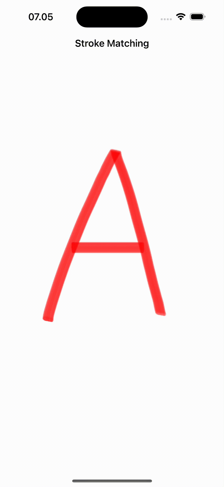

# SwiftUI with C++ & Bazel: StrokeMatching

This repository showcases the implementation of Stroke Matching, a gesture recognition feature to match the user-drawn strokes, using SwiftUI integrated with C++ and Bazel.

# Repository Contents:

- SwiftUI views and components designed for interactive gesture input using PencilKit.
- C++ algorithms for Stroke Matching computation.
- Bazel configuration files for project setup and building.

# Usage:
Clone the repository and explore the implementation details in each component. Modify and extend the codebase to integrate Stroke Matching into your own iOS projects.

# Video Demo

# Next Plan:
- Develop a web tutorial on implementing Stroke Matching.

# Aksaraya
Check out [Aksaraya](https://apps.apple.com/id/app/aksaraya-aksara-jawa/id1536319329) on the App Store for an example of Stroke Matching implemented in a real-world iOS application.

# Resources
- https://github.com/ganang/StrokeMatching
- https://developer.apple.com/documentation/pencilkit/drawing_with_pencilkit
- https://github.com/bazelbuild/rules_apple
